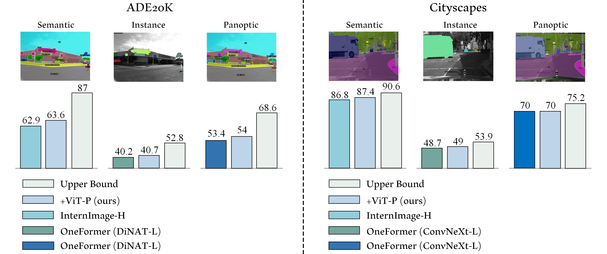
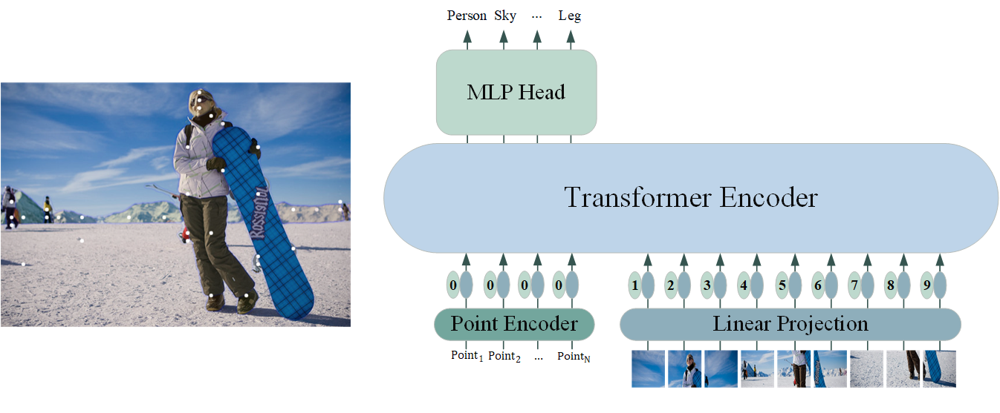

# The Missing Point in Vision Transformers for Universal Image Segmentation

This repository includes the implementation for our paper, The Missing Point in Vision Transformers for Universal Image Segmentation.



ViT-P is a two-stage segmentation framework that decouples mask generation from classification. The first stage employs a proposal generator to produce class-agnostic mask proposals, while the second stage utilizes a point-based classification model built on the vision transformer to refine predictions by focusing on mask central points. ViT-P serves as a pre-training-free adapter, allowing the integration of various pre-trained vision transformers without modifying their architecture, which ensures adaptability to dense prediction tasks. Additionally, ViT-P demonstrates that coarse and bounding box annotations can effectively enhance classification without requiring additional training on fine annotation datasets, thereby reducing annotation costs while maintaining strong performance. Extensive experiments across COCO, ADE20K, and Cityscapes datasets validate the effectiveness of ViT-P, achieving state-of-the-art results with 54.0 PQ on ADE20K panoptic segmentation, 87.4 mIoU on Cityscapes semantic segmentation, and 63.6 mIoU on ADE20K semantic segmentation.





## Evaluation

For evaluation, please refer to the **Oneformer** and **Internimage** folders where you can find detailed scripts and instructions:  
- [Oneformer+ViT-P Evaluation](./OneFormer)  
- [Internimage+ViT-P Evaluation](./InternImage)


## Training

Our training code is built based on the [DinoV2 repository](https://github.com/facebookresearch/dino-v2). 

To train the `ViT-P` on SLURM cluster, run:

```bash
sh train_ADE20K_base.sh
```


### Datasets
To create the training datasets, click on the [training dataset preparation](./ViT-P/datasets/README.md) script provided within the repository. Detailed instructions are available in the corresponding file.


### Installation
The training code requires PyTorch (version 2.0 or higher) and xFormers (version 0.0.18 or higher). You may work with any torch and xFormers versions that are mutually compatible.

To install the training dependencies, run:
```bash
pip install -r train_requirements.txt
```
**Note:** Additional installation steps are required for evaluation; please check the guidelines in both the **Internimage** and **Oneformer** folders.


**Note:** To execute the commands provided in the next section for evaluation, the dinov2 package must be included in the Python module search path.

```bash
cd ./ViT-P
export PYTHONPATH="$PYTHONPATH:$(pwd)"
  ```

## Acknowledgement

We thank the authors of [OneFormer](https://github.com/SHI-Labs/OneFormer), [InternImage](https://github.com/OpenGVLab/InternImage), and [dinov2][(https://github.com/SHI-Labs/Neighborhood-Attention-Transformer](https://github.com/facebookresearch/dinov2)) for releasing their helpful codebases.


